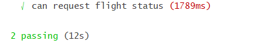
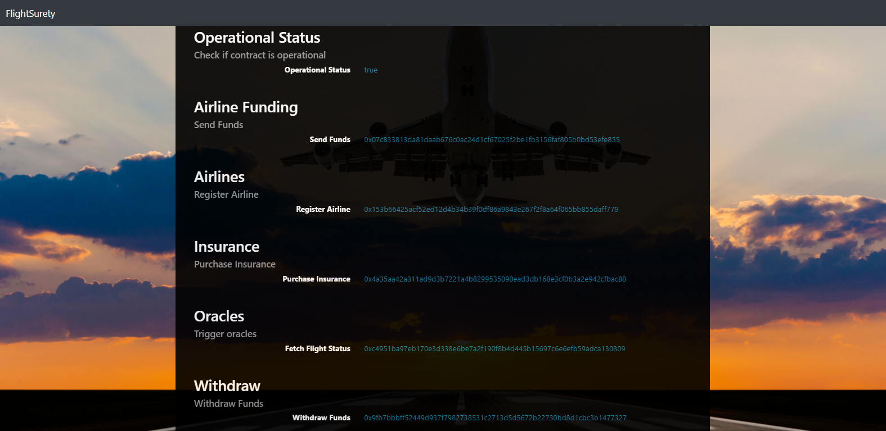

# Project Flight Surety
The Flight Surety Daap is a flight delay insurance for passengers sample application for Udacity's Blockchain Developer course.
**udbcd-flight-surety**

This project is connected to the _Blockchain Developer Nanodegree Program_ course by **Udacity**.
The Flight Surety Dapp is flight delay insurance for passengers managed as a collaboration between multiple airlines.
Passengers purchase insurance prior to a particualr flight.  If flight is delayed due to airline fault, passengers are paid 1.5x the amount they paid for the insurance.  Oracles provide flight status information.

The DApp User Interface when running should look like...


## Getting Started

The following instructions will get you a copy of the project and get you up and running on your local machine for development and testing purposes.

## Environment ###
This program requires **node.js**  and **npm** program envirenment 

## Prerequisites
Please make sure you've already installed 
  Tools and  used version
*   node               (v10.15.0)
*   npm                 (6.4.1)
*   Ganache CLI v6.2.5 (ganache-core: 2.3.3)
*   Truffle v5.0.12 (core: 5.0.12)
*   Solidity - ^0.4.24 (solc-js)
*   MetaMask extension for browser ( 6.1.0)
*   web3  (1.0.0-beta.46)

## Installing
This is a step-by-step series of examples that instruct you how to configure the development environmnet to a running state.
The project contains smart contract code in Solidity using Truffle, tests also using Truffle, dApp scaffoding based on the template and server app scaffolding based on the template.

#### Create a local working directory and then  clone github repository:
```
mkdir workspace
cd workspace
git clone https://github.com/milescw/udbcd-flight-surety.git
```
#### Install required node packages for Flight Surety project
Change to project folder ```udbcd-flight-surety```  and install all requisite npm packages (as listed in ```package.json```):

```
cd udbcd-flight-surety
npm install
```
#### Open a  terminal window and Launch Ganache:
If you are using ganache-cli use this command to add 50 funded accounts:
```
ganache-cli -m "candy maple cake sugar pudding cream honey rich smooth crumble sweet treat" -a 50

```
#### Open a separate terminal window and  compile smart contracts:
Change to project folder ```udbcd-flight-surety``` 
```
truffle compile
```
This will create the smart contract artifacts in folder ```./build/contracts```.

#### Migrate smart contracts to the locally running blockchain, ganache-cli:
Change to project folder ```udbcd-flight-surety``` 
```
truffle migrate --reset
```
This will :
  - deploy the smart contract artifacts to running Ganache 
  - create ```config.json``` file in folder ```./src/server```.

#### Test smart contracts:
Change to project folder ```udbcd-flight-surety``` 
```
truffle test ./test/flightSurety.js 
```
All tests should pass.

```
truffle test ./test/oracles.js  
```
All tests should pass.


#### In a separate terminal window, launch oracles server:
Change to server folder ```udbcd-flight-surety``` 
```
npm run server
```
#### In a separate terminal window, launch the DApp:
Change to client folder ```udbcd-flight-surety``` 
```
npm run dapp
```
Your terminal should look something like this:


## Testing DApp with User Interface.
Now we can test our DApp with the UI :
Open [http://localhost:8000](http://localhost:8000) to use the DApp User Interface.

Sequence of Operations:
1. First Fund airline
2. Register another airline
3. Purchase insurance
4. Get Flight Status
5. Withdraw Funds

## Testing Results



## Built With

* [Ethereum](https://www.ethereum.org/) - Ethereum is a decentralized platform that runs smart contracts
* [Truffle Framework](http://truffleframework.com/) - Truffle is the most popular development framework for Ethereum with a mission to make your life a whole lot easier.

## Acknowledgments
* Solidity
* Ganache-cli
* Truffle
* IPFS
* HTML
* JavaScript
* Node

## Resources

* [How does Ethereum work anyway?](https://medium.com/@preethikasireddy/how-does-ethereum-work-anyway-22d1df506369)
* [BIP39 Mnemonic Generator](https://iancoleman.io/bip39/)
* [Truffle Framework](http://truffleframework.com/)
* [Ganache Local Blockchain](http://truffleframework.com/ganache/)
* [Remix Solidity IDE](https://remix.ethereum.org/)
* [Solidity Language Reference](http://solidity.readthedocs.io/en/v0.4.24/)
* [Ethereum Blockchain Explorer](https://etherscan.io/)
* [Web3Js Reference](https://github.com/ethereum/wiki/wiki/JavaScript-API)